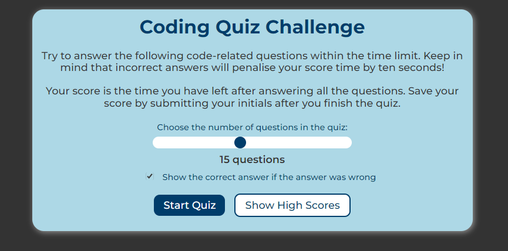
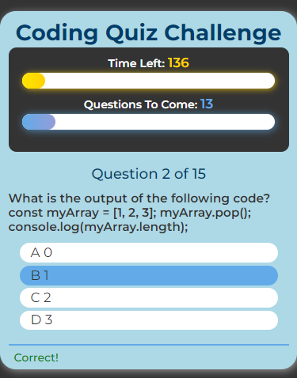
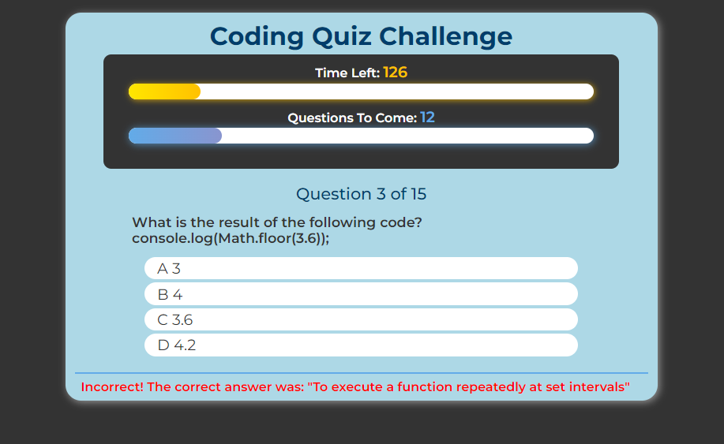
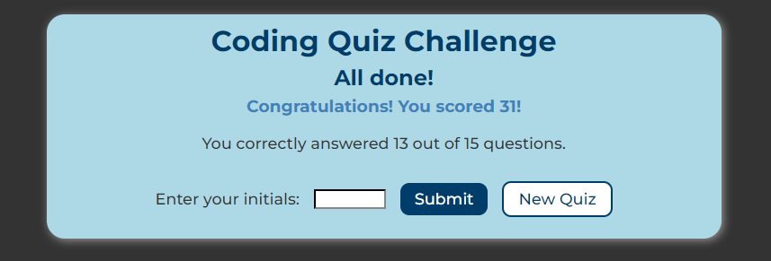
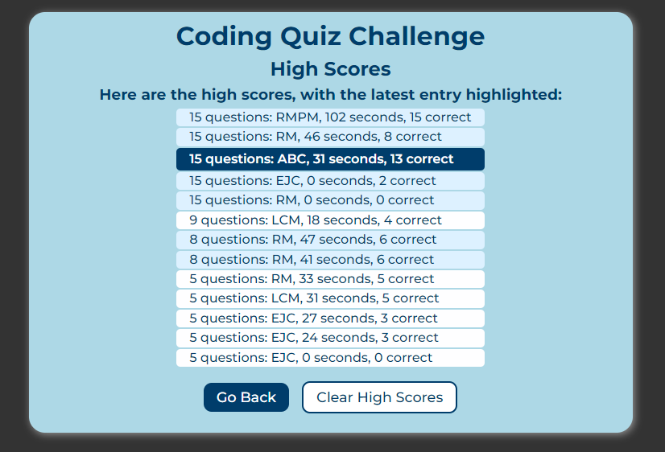

# Softworks JavaScript Coding Quiz

This web application allows a user to test their knowledge of JavaScript by answering a series of multiple-choice questions. The user can select the number of questions to be asked, and whether the correct answer is to be shown after an incorrect answer is shown.

The score is based on the time left on the timer, and the user can save their score to a high scores list. The high scores list ranks the scores based on questions asked, timer score and the number of correct answers. High scores are saved to local storage, and the user can clear the list if desired.

## Table of Contents

- [Features](#features)
- [Installation and Usage](#installation-and-usage)
- [Technologies Used](#technologies-used)
- [Screenshots](#screenshots)
- [Live URL and Repository](#live-url-and-repository)
- [Credits](#credits)
- [Contributing](#contributing)
- [License](#license)

## Features

 The application runs in a web browser and features dynamically updated HTML and CSS, and is powered by JavaScript. It has a simple, polished and responsive user interface that adapts to multiple screen sizes.

 The user options are as follows:

- Users can select the desired number of questions by moving a slider, between 5 and 28 questions. More questions can be easily inserted into the JavaScript file if desired by a programmer.
- Users can choose to see the correct answer after an incorrect answer is shown by checking a checkbox.
  
The application features the following:

- The quiz questions presented are randomly selected from a list of 28 questions.
  - The quiz questions are multiple-choice questions with 4 possible answers.
- A countdown timer starts at the start of the quiz and ends the quiz if the user does not answer all of the questions in time.
  - The user is given 10 seconds per question (ie 50 to 280 seconds depending on the number of questions asked)
  - A 10-second penalty is applied for each incorrect answer.
  - The countdown timer is displayed numerically and graphically with a progress bar.
- The number of questions asked is displayed, and the number of questions to come is displayed numerically and graphically with a progress bar.
- The user can choose their answer by:
  - clicking on the answer displayed on the screen
  - pressing the number key corresponding to the order of the answer (ie 1, 2, 3 or 4)
  - pressing the letter key corresponding to the order of the answer (ie A, B, C or D)
- The user is shown feedback below the next question whether their previous answer was correct or incorrect.
  - The correct answer is shown if the user chooses to see the correct answer after an incorrect answer is chosen.
  - After the last question is asked, the application pauses briefly to show the feedback.
- Upon completion of the quiz, the user is shown their score, and can enter their initials to save their score to the high scores list.
  - The high scores list is saved to local storage, and the user can clear the list if desired.
  - The high scores list ranks the scores based on the chosen number of questions to be asked, timer score and the number of correct answers.
  - The most recent score entered is highlighted in the high scores list.
- The user can start a new quiz at any time by refreshing the page, or clicking on buttons that navigate the page back to the starting screen.

## Installation and Usage

Clone the repository to your local machine and open the `index.html` file in your browser to view the quiz application, or go to the [live site](#live-url-and-repository).

1. Open the application in your web browser.
2. Select the number of questions to be asked by moving the slider.
3. Select whether the correct answer is to be shown after an incorrect answer is shown by checking the checkbox.
4. Click the "Start Quiz" button to start the quiz.
5. Answer the questions by clicking on the answer displayed on the screen, or by pressing the number key corresponding to the order of the answer (ie 1, 2, 3 or 4), or by pressing the letter key corresponding to the order of the answer (ie A, B, C or D).
6. When the quiz is complete, enter your initials to save your score to the high scores list.
7. Click the "Clear High Scores" button to clear the high scores list.
8. Click the "Go Back" or "New Quiz" button to start a new quiz.
9. High scores are viewed after initials are submitted, and can be viewed from the start screen by clicking the "Show High Scores" button.

## Technologies Used

- HTML
- CSS
  - Flexbox
  - Media Queries
  - CSS Variables
- JavaScript
  - DOM Manipulation
  - Event Listeners
  - Event Handlers
  - Custom Events
  - Local Storage
  - Functions
  - Classes

## Screenshots

### Desktop Browser - Start Screen

### Mobile Browser - Quiz Screen, correct answer feedback

### Desktop Browser - Quiz Screen, incorrect answer feedback

### Desktop Browser - Score Screen

### Desktop Browser - High Scores Screen

## Live URL and Repository

The live application can be accessed at the following URL: [Softworks JS Coding Quiz](https://renemalingre.github.io/Softworks-JS-Coding-Quiz/)

The repository can be accessed at the following URL: [Softworks JS Coding Quiz Repository](https://github.com/ReneMalingre/Softworks-JS-Coding-Quiz)

## Credits

- Google Fonts for the typeface - [Montserrat](https://fonts.google.com/specimen/Montserrat)

- Help from Mozilla [MDN Web Docs](https://developer.mozilla.org/) and OpenAI's [ChatGPT](https://chat.openai.com/chat) for answering my many questions about JavaScript

- OpenAI's [ChatGPT](https://chat.openai.com/chat) for coming up with many of the quiz questions used in this application.

- Normalize.css v8.0.1 for the CSS reset: [Normalize.css](https://necolas.github.io/normalize.css/)

## Contributing

Contributions to this project will not be accepted, as this project is an assessment piece for a coding course, and it must be the project author's own work. However, feel free to fork the repository and make your own changes.

## License

This project is licensed under the terms of the MIT license.

© 2023 René Malingré
